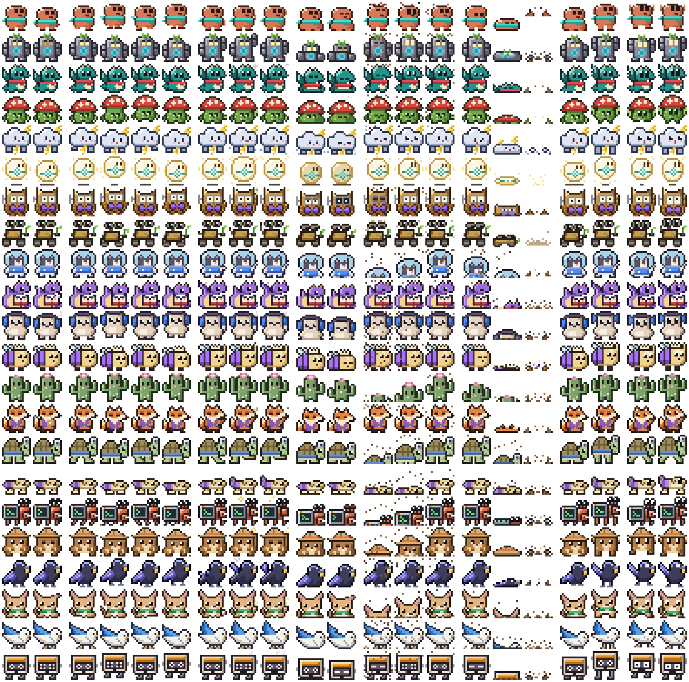

# agent-pet

A tiny pixel pet climbs out of the bottom of your screen when a coding-agent session is
waiting on you, and dives back under when you go back to that session. It works with Claude
Code and with pi. Each session opts in on its own by running `/pet`, and a session that never
runs it has no hooks, no state and no pet. One session gets one pet, and clicking that pet
jumps you back to the session it belongs to.



The sheet shows every shipped pack; `python3 scripts/sprite-sheet/sheet.py` redraws it after a pack changes.

<!-- TODO: add docs/screenshot.png, a real capture of pets along the bottom of the desktop. -->


## Requirements

- macOS 14 or later.
- Xcode Command Line Tools, for `swift build`.
- tmux, optional. You need it for click-to-focus and for prompt bar color sync. Without
  tmux the pet still appears, hides and animates. It just cannot focus a session.
- iTerm2, optional. With it, a click selects the exact tab. Without it, the click brings your
  terminal to the front.
- Claude Code with support for skill-frontmatter hooks, or pi, or both.

## Quick start

1. `git clone https://github.com/erxand/agent-pet.git` and enter the directory.
2. Run `./install.sh`. It builds the binary and installs the skill, the pi extension and the
   overlay daemon.
3. Open a new Claude Code session. An already-open session does not see the skill.
4. Type `/pet`, then let a turn finish. The pet climbs out along the bottom of the screen.

`~/.local/bin` must be on your `PATH`, because that is where `install.sh` links the binary.

## Letting pets stand on the Dock exactly

Pets treat a Dock at the bottom of the screen as ground. To know exactly where the Dock is, the
daemon needs Accessibility access. Without it, pets still work, but they follow an estimate of
the Dock's size and position.

macOS ties that access to the binary's code signature. A plain `./install.sh` build is signed
ad hoc, so every rebuild gets a new signature and macOS forgets the access. Sign the binary with
a certificate and a fixed identifier, and the access survives every rebuild.

1. Get a signing certificate. A free Apple Development certificate is enough: in Xcode, open
   Settings > Accounts, add your Apple ID, then Manage Certificates > + > Apple Development.
   Check that you have one:

   ```
   security find-identity -v -p codesigning
   ```

   Copy the name in quotes, for example `Apple Development: Your Name (TEAMID1234)`.
2. Install with that identity. `install.sh` signs the binary with the fixed identifier
   `com.agent-pet` when `AGENT_PET_SIGN_IDENTITY` is set, and restarts the daemon:

   ```
   AGENT_PET_SIGN_IDENTITY="Apple Development: Your Name (TEAMID1234)" ./install.sh
   ```

   To sign a binary you built another way, run
   `codesign --force --sign "Apple Development: Your Name (TEAMID1234)" --identifier com.agent-pet <path to agent-pet>`
   and restart the daemon.
3. Grant access once. Run `agent-pet dock-access --ask`, then turn on agent-pet in
   System Settings > Privacy & Security > Accessibility. `agent-pet dock-access` prints
   `granted` once the daemon has it.
4. Sign every rebuild the same way (keep `AGENT_PET_SIGN_IDENTITY` set when you run
   `install.sh`). The identity and the identifier stay the same, so macOS keeps the access.

## Usage

| form | effect |
|---|---|
| `/pet` | enroll this session with a default label, a randomly assigned sprite pack and that pack's accent color |
| `/pet <nickname>` | enroll with a label of your choosing |
| `/pet <nickname> cyan` | enroll with a label and a named accent color |
| `/pet <nickname> cyan sprite:golem` | also pick a sprite pack instead of the random one |
| `/pet off` | unenroll this session and stop its pet |

Word order does not matter. The accent name and the `sprite:` token are pulled out of the
text, and the rest becomes the nickname.

Left-click a pet to focus its session's tmux pane and terminal tab, then hide the pet.
Right-click to hide it without focusing.

Eight commands are useful from any shell, plus `agent-pet demo`, described under "Demo":

- `agent-pet status` prints one row per enrolled session (short id, label, sprite, accent,
  enabled, visible, mood, running subagent count, alive) and the daemon's pid. Add `--json` for
  the same as JSON, plus each session's agent, pid and focus target.
- `agent-pet preview` shows a fake pet for 20 seconds, so you can check the overlay without
  enrolling a real session. It picks a sprite the same way `on` does; add `--sprite <name>` to
  see a specific one.
- `agent-pet focus [--session ID]` runs exactly what a click runs. It exits 2 when the session
  has no record, or has no tmux pane while the default focuser is in use. Add `--no-client-switch` to select the window and pane and
  leave every attached client where it is.
- `agent-pet clear-subagents [--session ID]` forgets every subagent the session counts as
  running and prints how many it dropped. It exits 2 when the session has no record.
- `agent-pet render --pack NAME [--animation idle] [--frame N] [--accent COLOR]` draws a sprite in the
  terminal with truecolor half blocks, two pixel rows per line, so a picker can show the pets without
  the overlay. `--accent` shows the pet as a session that chose that color would see it. `--animation`
  is one of `idle`, `walk`, `wave`, `sit`, `emerge`, `dive`, `jump` and `fall`.
- `agent-pet packs [--json]` lists the installed packs with their accent, whether the config reserves
  them, and how many live pets use each.
- `agent-pet scan-transcript --path FILE [--from OFFSET]` is a diagnostic. It reads a
  transcript file from byte OFFSET (default 0) and prints one line per subagent completion
  that agent-pet would see, in file order: the byte offset, `finished` or `interim`, and the
  agent id. It changes no record.
- `agent-pet capabilities` prints one word per line, one for each feature this build has, such as
  `focus-target-select`. A script that drives agent-pet can check for a word instead of comparing
  versions, and a build that predates the command exits 2.
- `agent-pet dock-access` prints `granted`, `not granted` or `unknown`: whether the running daemon
  may read the Dock's exact frame (macOS Accessibility). It reports the daemon's own access, not
  the terminal's, and never prompts; `unknown` means the daemon is not running.
  `agent-pet dock-access --ask` has the daemon ask macOS once; turn agent-pet on in
  System Settings > Privacy & Security > Accessibility and the daemon notices within 5 seconds.
  Sign the binary first so the access survives rebuilds, see "Letting pets stand on the Dock exactly".

## Demo

`agent-pet demo` plays a short tour on your desktop. The title card stays for about 6 seconds. Each
next scene plays, then waits until you press the space bar. A caption at the bottom of the screen tells
you what each scene shows:

- The states of a pet that you see, side by side, each with a label. A pet climbs out of the ground and
  walks when its agent finishes a turn. It stands still under a `!` bubble when its agent needs your
  input. A working agent has no pet.
- A click on a pet brings the terminal tab of its session to the front. The demo shows this: a drawn
  pixel cursor moves to a pet and clicks it, the pet dives, and a drawn picture of a Claude Code session appears. The
  cursor and the terminal are only pictures. The demo does not move your mouse pointer, and it does not
  open a real terminal, and it posts no system events. The demo pets have no session and ignore the
  mouse. They stand on a row above your real pets, so they never cover one.

The last card, "Configure things to your system", names some of what you can change: labels,
sprites, colors, how a click focuses, and more. See [Configuration](#configuration).

Press space for the next scene. Space also skips the title card. Press esc to quit. The demo takes
the keyboard focus when it starts, so these keys do not go to another app. When the demo ends, it gives
the focus back to the app that had it before. If you click another app during the tour, the demo waits
and does not take the focus back. The caption then says "click here, then press space". Click any
demo panel (a caption, a title card or the terminal) to give the keys back to the demo. This click does
not go to the next scene. Ctrl-C in the terminal or SIGTERM also closes all demo windows and
stops the demo.

The demo runs in its own process with a cast that exists only in memory. It writes no session record.
It does not start the daemon or send it data. It does not focus a session or type into a pane. Thus you
can run it next to real pets. It uses your installed packs, the folders in `spriteDirectories` and the
display your `display` setting picks. When it runs from a checkout, it also uses the `sprites/` directory
of the repo.

| form | effect |
|---|---|
| `agent-pet demo` | play all scenes. Each scene after the title waits for the space bar |
| `agent-pet demo --auto` | play all scenes on a timer, about 26 seconds, with no keys needed |
| `agent-pet demo --scene NAME` | play one scene. `--list` shows the names |
| `agent-pet demo --list` | print each scene with its length, `auto` or `space`, and its caption |
| `agent-pet demo --speed 2` | play faster. A value below 1 plays slower |
| `agent-pet demo --dry-run` | print the timed timeline in the terminal, and draw nothing |
| `agent-pet demo --snapshot DIR` | write PNGs of the title card, a caption with each key hint, the click scene, the states scene and the terminal reveal to DIR |
| `agent-pet demo --scene space` | an extra scene, not part of the tour: a stand-in screensaver comes up and the pets float over it, as a script would make them with `agent-pet physics float`, then they fall, land and walk home. With `--snapshot DIR` it also writes `space-1.png` to `space-5.png` |

## Configuration

With no config file, agent-pet behaves exactly as described above. To change how it focuses a
session, where it looks for Claude Code sessions, or whether it touches the prompt bar, write
`~/.agent-pet/config.json` (or point `AGENT_PET_CONFIG` at another file). Every key is optional,
and a missing key, an unknown key or a value agent-pet does not understand means the default:

```json
{
  "focuser": { "kind": "command", "command": ["/Users/me/bin/focus-my-session"] },
  "sessionDirectories": ["~/.claude/sessions", "~/.claude-*/sessions"],
  "colorSync": "none",
  "labelPlacement": "nametag",
  "disambiguateLabels": true,
  "reservedSprites": ["claude"],
  "spriteDirectories": ["~/Library/Mobile Documents/com~apple~CloudDocs/pets"],
  "settleSeconds": 1,
  "holdWhileBusy": true,
  "accentInks": true,
  "diveOnExit": true,
  "subagentToolsKeepNeedsInput": true,
  "display": "primary",
  "whenFullScreen": [
    {"bundleIds": ["com.example.screensaver"], "apply": {"physics": "float", "input": "off", "level": "above"}}
  ]
}
```

| key | default | what it does |
|---|---|---|
| `focuser` | `{"kind": "tmux-iterm"}` | what a click runs. `tmux-iterm` is the tmux and iTerm2 focus described below. `command` runs your own program instead |
| `sessionDirectories` | `["~/.claude/sessions"]` | where Claude Code session files are read for labels and liveness. `~` and `*` expand, so `~/.claude-*/sessions` covers every extra Claude config root |
| `colorSync` | `"tmux-color"` | `none` stops agent-pet from typing `/color` into the session's pane |
| `labelPlacement` | `"pill"` | `nametag` puts the label over the pet's head on a dark tag in a pixel font, readable on any desktop |
| `disambiguateLabels` | `false` | when two visible pets show the same label, both get a space and the last 4 characters of their session id. Sessions enrolled with `--disambiguator TEXT --disambiguation-scope KEY` that clash inside one scope get TEXT instead |
| `reservedSprites` | `[]` | packs that random assignment never picks. `--sprite <name>` can still choose one |
| `spriteDirectories` | `[]` | more folders of sprite packs, laid out like `~/.agent-pet/sprites/`. Their packs join the random pool, `packs`, `render` and `--sprite`. `~` and `*` expand. On a name clash `~/.agent-pet/sprites/` wins |
| `settleSeconds` | `0` | how long a session must stay waiting before its pet comes up, so a queued message that starts right after Claude finishes never flashes a pet. About `1` covers it. `0` shows at once |
| `holdWhileBusy` | `false` | `true` keeps a pet down while Claude Code says the session is busy again after its turn ended, such as during a `!` command, which fires no hook |
| `accentInks` | `false` | `true` lets a color you choose (`/pet <nickname> <color>`, `--accent`) paint part of the creature too, not only the label dot, the bubble and the prompt bar |
| `diveOnExit` | `false` | `true` makes a stopping daemon (a launchd restart, Ctrl-C) dive its pets before it exits instead of dropping them. Read when the daemon starts |
| `subagentToolsKeepNeedsInput` | `false` | `true` keeps a `needsInput` pet up while background subagents call tools, so a question one subagent asked stays visible until the main agent moves on. Off, any tool call hides the pet |
| `whenFullScreen` | `[]` | rules that set pet states while an app shows a window covering a display, see "Scripting the pets" |
| `hideLabelsWhileFloating` | `false` | `true` hides each pet's label and bubble while it floats or falls, and shows them again when it lands |
| `dockGround` | `true` | a Dock at the bottom of the screen is ground: pets are sprung up onto it when it slides in, walk on it, fall off when it hides, and jump up its edges, so they never stand over its icons. `false` keeps them on the bottom edge of the usable screen. For the exact Dock frame, give the agent-pet daemon Accessibility access (`agent-pet dock-access --ask`) and sign the binary so the access sticks, see "Letting pets stand on the Dock exactly"; without it pets follow an estimate. Falls from a float play the `fall` animation whatever this key says |
| `groundGap` | absent | points between a pet's feet and the ground, on the screen bottom and on the Dock alike. Absent keeps today's look (a small lift, with the label pill under the feet). `0` stands pets right on the edge; the pill then sits over the head |
| `display` | `"focused"` | which display the pets live on when there are several. `focused` follows the display with keyboard focus. `primary` keeps them on the primary display (the one with the menu bar in System Settings), and follows macOS when the primary changes, such as when a laptop lid closes. `name:<display name>` picks one display by the name macOS gives it in System Settings > Displays, and uses the primary display while that one is not attached |

The daemon rereads the file when it changes, so there is nothing to restart (`diveOnExit` aside). With `primary` or
`name:`, the pets also move when a display is attached, removed or rearranged, keep their lanes and
their animation, and are never left on a display that went away. `primary` may be the better
default; it is left as `focused` so that no config keeps the behavior from before, and the choice is
the maintainer's.

A `command` focuser gets the session in its environment: `AGENT_PET_SESSION_ID`, `AGENT_PET_PID`,
`AGENT_PET_FOCUS_TARGET`, `AGENT_PET_GROUP` and `AGENT_PET_AGENT`. Its first entry must be an
absolute path. It runs with no input, and agent-pet stops it after 5 seconds. `AGENT_PET_FOCUS_TARGET`
is whatever you stored with `agent-pet on --focus-target TEXT`, which agent-pet keeps but never reads,
so a terminal other than iTerm2 can stash its own pane id there.

`agent-pet on --session ID` works from any shell, so a launcher can enroll a session it is about to
start. Running `on` again for a session that is already enrolled updates it in place: it keeps the
sprite, the accent, the focus target and the subagents it is tracking.

Several sessions can share one pet. `agent-pet on --session ID --group KEY` puts a session in the pet
named KEY, and `--owner` makes it the pet's owner, whose label, sprite and accent the pet wears. With
no owner flagged, the first member to join owns it. The pet shows `!` at once when any member needs
input. It shows ready only when every member is done: while one of them is still working, or still has
subagents running, the others' ready waits. A member you dismissed counts as done. When the group has several members, the bubble names the one that is
waiting, a click jumps to it (or to the owner when none is), and the pet hides for all of them. A new
member takes the owner's sprite, and `status --json` reports each session's `group` and whether it is
the `owner`.

`--group-mode lead` on the owner changes that for a window with one lead session and helpers (the owner's
own mode decides it, so `--group-mode shared` on the owner turns it off again). The pet then wears the
owner's label and a click always goes to the owner. Ready still waits for every member. A helper's
question gets a pet of its own at once, with the helper's label and click. Hiding the owner (for example
`agent-pet hide --focus-target PANE` when you switch to its pane) hides every member's ready too. With
no live owner the group acts as a plain group, labelled by the member that is waiting.

The hooks are also safe to install for every session in Claude Code's `settings.json`, instead of or
beside the `/pet` skill. For a session that never enrolled, `agent-pet hook` exits in a few
milliseconds and writes nothing, and when both sets of hooks fire for the same event, the event
counts once.

## Scripting the pets

Four states change what every pet does, and your own scripts can set them. Each is a command:

| command | what it does |
|---|---|
| `agent-pet physics float` | every pet lifts off and drifts and spins slowly, as if in space |
| `agent-pet physics ground` | they fall, land and walk to their lanes, which follow where each one landed (the default) |
| `agent-pet input off` | every pet ignores the mouse: clicks go to whatever is under it, a pet never takes focus and never runs the focuser, and a focus command already running is stopped |
| `agent-pet input on` | pets take clicks again (the default) |
| `agent-pet visibility hidden` | every pet dives; nothing about the sessions changes |
| `agent-pet visibility shown` | they come back up (the default) |
| `agent-pet level above <bundle id>` | pets draw just above that app's topmost window, never above the real lock screen |
| `agent-pet level normal` | the normal level (the default) |

`auto` instead of a value (`agent-pet physics auto`) hands that state back to the config rules, or to the
default. `agent-pet status --json` reports each state with its value and where it came from: `cli`,
`trigger` (a config rule) or `default`. A command always beats a rule. Commands last until the daemon
restarts; rules are in the config, so they last.

The same thing can come from the config. A rule sets states while any listed app shows a window that
covers a display, and the states go back to `auto` when the window goes. For a screensaver that runs as
an ordinary app with a full screen window:

```json
{
  "whenFullScreen": [
    {"bundleIds": ["com.example.screensaver"], "apply": {"physics": "float", "input": "off", "level": "above"}}
  ]
}
```

`apply` takes `physics`, `input`, `visibility`, and `level` as `normal` or `above` (above the app that
matched). Detection reads the window list once a second while a listed app runs, and needs no
permission. The same rule, done from a shell script that knows when the screensaver starts and stops:

```sh
#!/bin/sh
case "$1" in
  start) agent-pet physics float; agent-pet input off; agent-pet level above com.example.screensaver ;;
  stop)  agent-pet physics auto;  agent-pet input auto; agent-pet level auto ;;
esac
```

This is also the way to try the float without a screensaver: run `agent-pet physics float`, watch, then
`agent-pet physics auto`.

## How it works

There are three parts:

1. The Claude Code skill registers session-scoped hooks, and the pi extension subscribes to pi
   events. Both call the `agent-pet` CLI, which writes one JSON record per session into
   `~/.agent-pet/sessions/`.
2. A launchd user agent runs the overlay daemon. It polls that directory and reconciles one
   borderless always-on-top window per record marked visible, so the record is the only thing
   that decides whether a pet is on screen. Sprite pack folders and Claude Code session folders are
   rescanned only when FSEvents reports a change in them, and at least every 5 seconds.
3. A left click runs tmux `select-window`, `select-pane` and `switch-client`, then an
   AppleScript that selects the matching iTerm2 tab and brings the window forward.

Claude Code events:

| event | what agent-pet does |
|---|---|
| `Stop` | read finished subagents from the transcript and drop stale ones, then show the pet (mood `ready`, with the first line of the last assistant message as its status text) if no background subagents are left, or keep it hidden if any are still running |
| `Notification` of type `permission_prompt`, `worker_permission_prompt`, `agent_needs_input`, `elicitation_dialog` or `elicitation_url_dialog` | show the pet, mood `needsInput`, whatever the subagents are doing |
| `SubagentStart` | record that subagent as running, and hide the pet |
| `SubagentStop` | record that subagent as finished, and show or hide nothing |
| `UserPromptSubmit` | hide the pet, and nothing else. A new prompt does not end a running subagent |
| `PreToolUse` | hide the pet |
| `SessionEnd` | delete the session's record |

Claude Code fires `Stop` when the main agent's turn ends, and it fires it even while that
session has background subagents running, because finishing one of those subagents re-invokes
the main agent. So `Stop` on its own does not mean the session is waiting on you, which is why
the record tracks running subagents and a `Stop` with any of them left hides instead of shows.

`SubagentStop` does not fire for background agents in practice. When a background agent
finishes, Claude Code writes a task notification into the session's transcript file (the
`transcript_path` every hook receives) and re-invokes the main agent. So on `Stop`,
`SubagentStart` and `SubagentStop`, agent-pet reads the part of the transcript it has not read
yet, and every `<task-id>` followed by a `<status>` tag marks that subagent as finished.

Two exceptions came out of a real session:

- Claude Code also writes a task notification when an agent only pauses while its own
  background work is still running. Its `<note>` says the agent "stopped with background work
  of its own still running", and the agent can resume on its own later. agent-pet reads that
  note and counts the notification as interim: the subagent stays tracked, so the pet stays
  hidden.
- Some agents end with no task notification at all. Their only trace is a hand-back message,
  `<agent-message from="ID">` followed by `[Subagent hand-back]`. agent-pet treats that as
  finished too. A plain agent message without the hand-back marker is not a completion.

As a safety net, a subagent recorded more than 3 hours ago is dropped as expired. If the pet
still stays hidden because of a subagent that is long gone, run `agent-pet clear-subagents`.
To see what agent-pet reads from a transcript, run
`agent-pet scan-transcript --path <transcript_path>`.

This changed nothing in the hook set, so a session that already ran `/pet` needs no
re-enrollment to get it.

pi events:

| event | agent-pet command |
|---|---|
| `agent_settled` | `show --mood ready` |
| `ui_prompt_start` | `show --mood needsInput` |
| `ui_prompt_end` | `hide` |
| `input`, when the source is `interactive` | `hide` |
| `tool_execution_start` | `hide` |
| `session_shutdown` | `remove` |

`agent_settled` is the only pi event that shows a ready pet. It fires once pi has fully
settled, with no retry, no auto-compaction and no queued follow-up left, so the pet stays
hidden while pi works. Every pi call is fire and forget with a two second timeout.

## Telling sessions apart

Sessions differ in four ways.

**Sprite pack**: each session gets its own creature. When `/pet` runs without a `sprite:` token,
agent-pet picks one of the installed packs at random among the packs that the fewest other live
sessions are using, so no two sessions share a pet until there are more sessions than packs.
The pick is stored in the session's record, so it stays put for the life of the session.
`sprite:<name>` chooses one explicitly. The repo ships 22: `claude` (the original orange
critter), `golem`, `hatchling`, `mossling`, `nimbus`, `seon`, `tinowl`, `walle`, `astrocat`,
`bookwyrm`, `bopkin`, `bumble`, `cactling`, `dapperfox`, `docturtle`, `gecklet`, `hermy`,
`rangermot`, `raven`, `scruff`, `skyhop` and `tapeling`.

**Accent color**, on the label dot, the mood bubble and the Claude Code prompt bar. It takes the
color of the session's sprite pack, so a glance at the prompt bar tells you which creature is
yours. `/pet <nickname> <color>` overrides it. With `"accentInks": true` in the config, a color you
choose this way also paints the pet: every shipped pack but `claude` and `walle` hands one part of the creature to the accent (golem's chest gem,
hatchling's scarf, mossling's cap, nimbus's lightning, seon's face mark, tinowl's bow tie, and one
part of each of the newer packs), so
sessions that share a creature still look different. A session that only took its pack's color
keeps the pack's own look.

| pack      | accent |
|-----------|--------|
| claude    | orange |
| golem     | green  |
| hatchling | cyan   |
| mossling  | red    |
| nimbus    | blue   |
| seon      | yellow |
| tinowl    | purple |
| walle     | yellow |
| astrocat  | blue   |
| bookwyrm  | red    |
| bopkin    | blue   |
| bumble    | purple |
| cactling  | pink   |
| dapperfox | purple |
| docturtle | blue   |
| gecklet   | purple |
| hermy     | green  |
| rangermot | orange |
| raven     | purple |
| scruff    | green  |
| skyhop    | blue   |
| tapeling  | orange |

A pack of your own sets its color with the `accent` field in `pack.json`. Without that field,
agent-pet uses the pack's most common color, leaving out the two darkest ones (the outline and
the eyes), matched to the nearest name below. Only a session with no installed pack at all gets
a color derived from its session id. A session that already has an accent keeps it.

The eight accent names:

| name   | hex     |
|--------|---------|
| red    | #FF5252 |
| blue   | #4C8DFF |
| green  | #4ADE80 |
| yellow | #FFD93D |
| purple | #A970FF |
| orange | #FF9F1C |
| pink   | #FF7EB6 |
| cyan   | #2EE6D6 |

These are the same eight names Claude Code's `/color` command takes. `/pet` sets the session's
prompt bar color to match the accent, by typing `/color <accent>` into the session's tmux pane,
and `/pet off` resets it to `default`. Pass `--no-color-sync` to `agent-pet on` or
`agent-pet off` to skip that. agent-pet never syncs a pi session, because pi has no prompt bar
color.

**Label**, shown under the sprite on a dark pill (or over its head, with `labelPlacement`
`nametag`): your nickname, or the session's own name, or the basename of its working directory.

**Lane**: the visible pets split the screen width into equal lanes, one each, and each pet wanders
across its whole lane, so a lone pet roams the full width and two pets never overlap. When pets come
or go the lanes are divided again and each pet walks to its new one.

## Customizing the pet

A sprite pack is a directory of plain text, so you can draw a new pet in any editor. See
sprites/README.md for the full rules.

```
<pack-name>/pack.json                    name, frameSize, optional accent and accentInks, and a character-to-hex palette
<pack-name>/idle.txt walk.txt wave.txt sit.txt    frames of frameSize square rows, blank line between frames
<pack-name>/emerge.txt dive.txt          optional, 3 frames each
<pack-name>/jump.txt fall.txt            optional, 2 frames each (takeoff, rise; apex, later fall); without them a jump shows walk and a fall shows idle
```

Every color in a pack comes from its palette, except the inks named in the optional `accentInks`
field (`{"accent":"A","shade":"a"}`): when the config turns `accentInks` on and a session chose
its accent, those pixels are painted in it and in a darker shade of it. The optional `accent` field in `pack.json` names one of the eight accent colors, and every
session that gets the pack uses it for the label dot, the mood bubble and the prompt bar.

Packs live in `~/.agent-pet/sprites/<name>/`. `install.sh` refreshes every shipped pack there on
each install, so edits to a pack with the name of any pack in the repo's `sprites/` folder are
overwritten. To customize a shipped pack, copy it under a new name and
edit the copy. `install.sh` leaves packs with other names alone. Every installed pack joins the
random pool, so dropping a new directory in is all it takes to add a pet.

To keep packs somewhere else (prototypes, your own creatures, a folder synced through iCloud
Drive), name the folder in `spriteDirectories` in the config. Its packs count as installed
everywhere, and a pack added there later is picked up without a restart. When two folders hold
a pack with the same name, `~/.agent-pet/sprites/` wins, then the folders in the order listed.

## Troubleshooting

- `agent-pet status` prints every enrolled session and the daemon's pid. A `visible` session
  with no pet on screen, plus `daemon pid: none`, means the daemon is down.
- `~/.agent-pet/daemon.log` holds the daemon's output. Each run opens with a line like
  `agent-pet daemon started pid 80924 parent 1 at 2026-09-29T17:04:11Z`, so you can tell which
  run produced a later crash trace. The daemon truncates this log at startup past 1 MB.
- `~/.agent-pet/hooks.log` holds one line per handled hook event, such as
  `2026-09-29T18:14:07Z Stop 07619c1a - visible=true agents=0`: the time, the event, the first
  eight characters of the session id, the subagent's `agent_id` or `-`, and the record's state
  after the write. A pet that appears at the wrong moment shows up here as the event that set
  `visible=true`. `PreToolUse` lines also name the tool, as `tool=Bash`. A `Stop` line that
  found finished, interim or expired subagents ends with `completed=<n> interim=<k> expired=<m>`,
  and each expired subagent gets its own `SubagentExpired` line. `interim` counts tracked
  subagents that only paused, which stay tracked.
- A pet that never appears even though the session is waiting on you, with `agents=` above 0 on
  every `Stop` line, means agent-pet still counts a subagent as running. Run
  `agent-pet clear-subagents --session ID` to empty the count. It prints how many it dropped,
  and the next `Stop` shows the pet. A forgotten subagent also expires on its own after 3 hours.
- A record left behind by a session that ended without its `SessionEnd` hook shows `ALIVE no`,
  and the daemon sweeps it within about 5 seconds. To drop one now, run
  `agent-pet remove --session ID`.
- launchd restarts a crashed daemon on its own, and the next `Stop` hook kickstarts it too. To
  force it: `launchctl kickstart gui/$(id -u)/com.agent-pet.daemon`.
  `launchctl print gui/$(id -u)/com.agent-pet.daemon` shows the state and pid.
- Hooks live in the Claude Code process that ran `/pet`. A session you reopen with
  `claude --resume` is a new process with no hooks, so run `/pet` again in it.
- The first click that reaches iTerm2 makes macOS ask whether agent-pet may control it. Allow
  it to get the exact tab. Deny it and you keep everything else. agent-pet still selects the
  tmux window and the pane, and the terminal still comes to the front.

## Uninstall

Run `./uninstall.sh`. It unloads the launch agent, deletes its plist and the three symlinks,
and stops the daemon if it is still running. It leaves `~/.agent-pet` in place and prints the
`rm -rf` command for it.

## State directory

```
~/.agent-pet/
  sessions/<session_id>.json   one record per enrolled session
  sessions/<session_id>.lock   the lock that keeps two writers off one record
  sprites/<pack>/              installed sprite packs
  config.json                  optional settings, see "Configuration"
  daemon.pid                   pid of the running overlay daemon
  daemon.log                   daemon output
  hooks.log                    one line per handled hook event
```

Delete a session's record, or run `/pet off` in that session, to remove its pet.

## Development

`swift build`, and `scripts/test.sh` for the tests. The script runs `swift test` with the framework
flags that a machine with only the Command Line Tools needs: there, a plain `swift test` fails with
`no such module 'Testing'`. Extra arguments go through to `swift test`. The tests run the binary in a
temporary home with a stub tmux, so they never touch your `~/.agent-pet`, your Claude Code sessions or
the running daemon.

## Design notes

DESIGN.md is the contract: state shape, concurrency, daemon lifecycle, overlay, sprites, contracts
and configuration.
